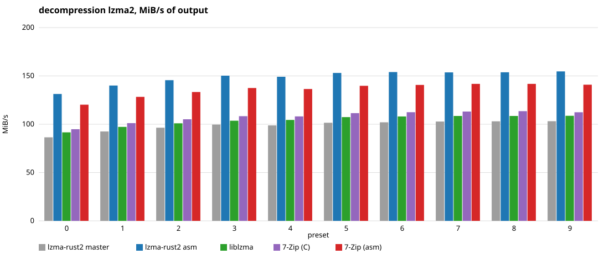
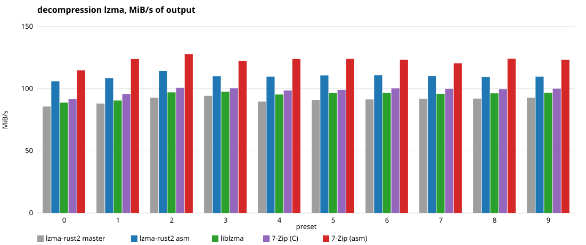

# Decoding benchmark

Single-threaded decoding of `tests/data/executable.exe` at every preset, the way
the crate's README measures it, by five decoders over the same compressed bytes:

- **lzma-rust2 master**: the master branch this branch was made from, as a git
  dependency.
- **lzma-rust2 asm**: this branch, whose `optimization` feature decodes the
  literal, the matched literal and the bit trees through inline assembly
  kernels on aarch64, which load both children of a tree node before the bit
  that chooses between them is known (the trick of the LZMA SDK's arm64
  decoder), and whose `LzmaReader` reads its input through a buffer.
- **liblzma**: the `liblzma` crate over the C library of the same name.
- **7-Zip (C)**: the LZMA SDK's `LzmaDec.c` and `Lzma2Dec.c` as shipped in
  7-Zip 26.02 (`lzma-sdk/`, public domain).
- **7-Zip (asm)**: the same with `LzmaDecOpt.S` as the inner loop, which is
  what 7-Zip's own arm64 binary runs. On other targets only the C build is
  made.

Each stream is compressed once by this branch's encoder, and each decoder's
output is checked against the input before it is timed. The LZMA streams carry
the `.lzma` header, the LZMA2 streams are raw.

```
cd benchmark
cargo bench --bench decoding
python3 report.py      # the tables below and the charts in assets/
```

The package is a workspace of its own so that it leaves the crate's lock file
alone. `build.rs` compiles the SDK decoder twice through `cc`, with the
functions of each build renamed (`lzma-sdk/rename_*.h`) so that both link into
the one benchmark binary.

## Results

Apple M3 Max, macOS, rustc 1.98, 7-Zip's SDK 26.02, liblzma 5.8.3 (the crate's
bundled copy), lzma-rust2 master at 5614fd5. MiB/s of output, Criterion's mean
of 20 samples.

### decompression lzma2

This branch decodes 1.2 to 1.25 times faster than master and about 1.15 times
faster than liblzma. 7-Zip's own arm64 build, whose whole decoding loop is
assembly with nothing between bits leaving the registers, stays about 10%
ahead of kernels called from Rust.

| preset | lzma-rust2 master | lzma-rust2 asm | liblzma | 7-Zip (C) | 7-Zip (asm) |
|---|---:|---:|---:|---:|---:|
| 0 | 85 | 106 | 90 | 93 | 118 |
| 1 | 90 | 113 | 94 | 99 | 125 |
| 2 | 94 | 117 | 99 | 100 | 128 |
| 3 | 94 | 119 | 101 | 104 | 130 |
| 4 | 95 | 117 | 100 | 104 | 131 |
| 5 | 96 | 117 | 98 | 104 | 128 |
| 6 | 93 | 114 | 98 | 99 | 129 |
| 7 | 95 | 119 | 103 | 104 | 132 |
| 8 | 97 | 119 | 102 | 106 | 132 |
| 9 | 95 | 118 | 103 | 106 | 131 |



### decompression lzma

The same through `LzmaReader`, which on this branch reads its input through a
buffer and so decodes through the kernels too.

| preset | lzma-rust2 master | lzma-rust2 asm | liblzma | 7-Zip (C) | 7-Zip (asm) |
|---|---:|---:|---:|---:|---:|
| 0 | 86 | 106 | 89 | 92 | 115 |
| 1 | 88 | 108 | 91 | 96 | 124 |
| 2 | 93 | 114 | 97 | 101 | 128 |
| 3 | 94 | 110 | 98 | 100 | 122 |
| 4 | 90 | 110 | 95 | 99 | 124 |
| 5 | 91 | 111 | 96 | 99 | 124 |
| 6 | 91 | 111 | 97 | 100 | 123 |
| 7 | 92 | 110 | 96 | 100 | 120 |
| 8 | 92 | 109 | 96 | 100 | 124 |
| 9 | 93 | 110 | 97 | 100 | 123 |


